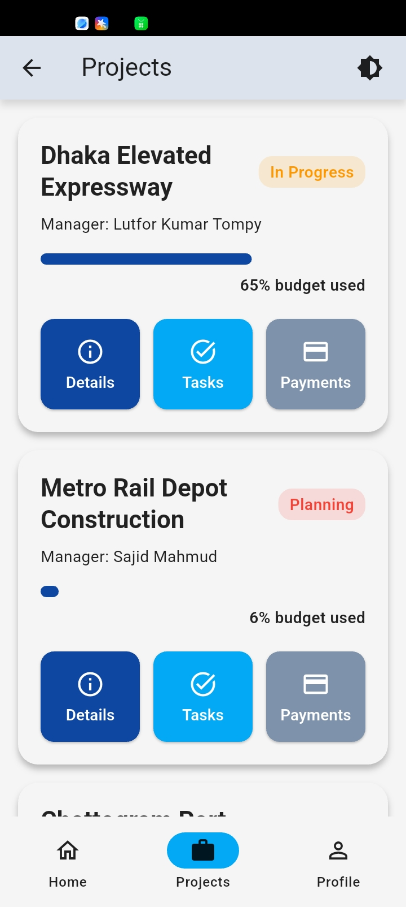
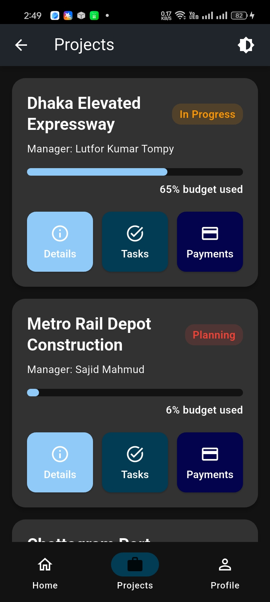
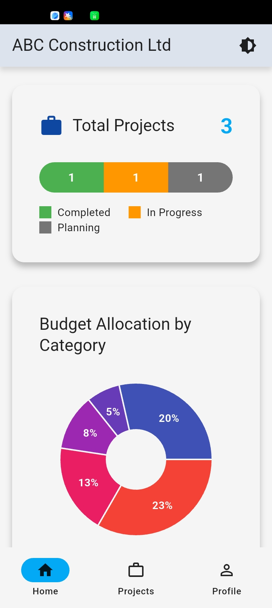
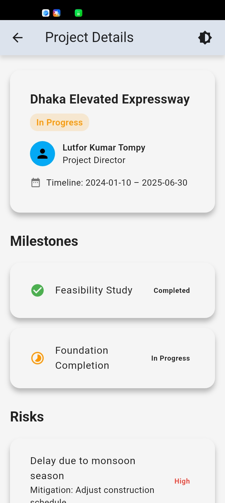
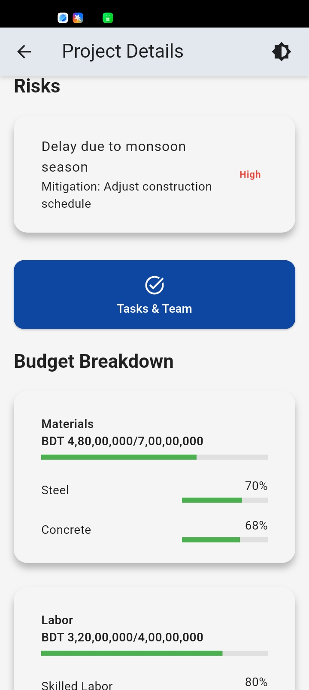
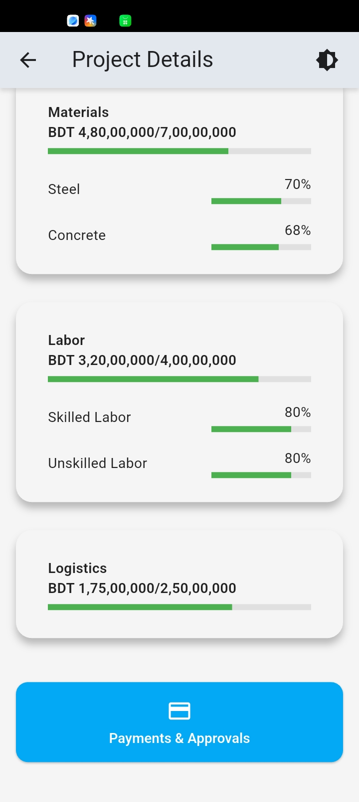
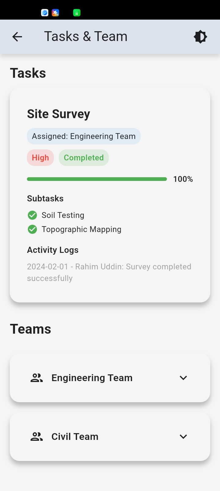
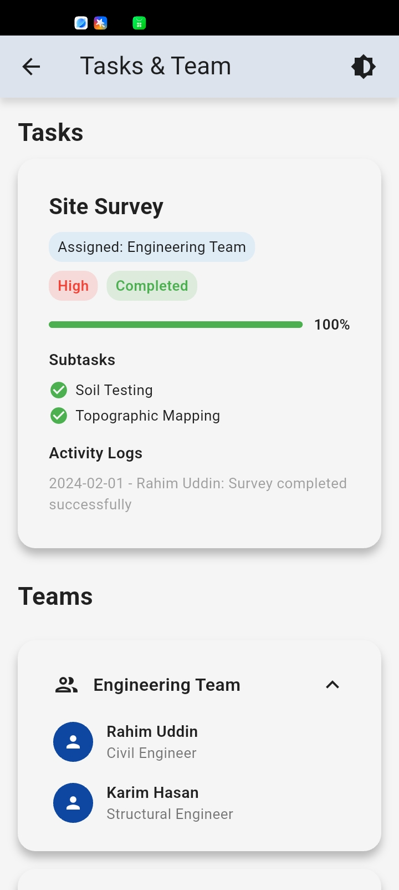
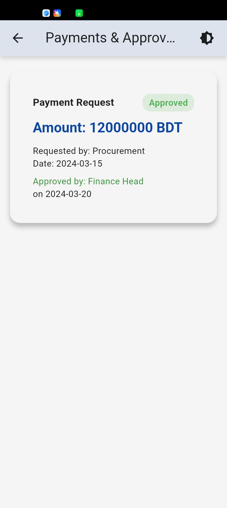

# ABC Construction Project Management App

**A Flutter-based project management application for ABC Construction Ltd.**  
ABC Construction Project Management App is a comprehensive Flutter-based application designed for construction project oversight. It provides project managers, team leads, and stakeholders with a centralized platform to efficiently plan, monitor, and control projects. Users can manage project timelines, budgets, tasks, team members, and payment workflows in real time, ensuring better collaboration, accountability, and informed decision-making across all phases of a construction project.

- **Key highlights of the app:**
    - Real-time project monitoring with status updates and milestone tracking. 
    - Task management with progress indicators, sub-tasks, and activity logs. 
    - Team management through expandable accordions, showing roles and responsibilities. 
    - Payment and approval workflows to track requests, approvals, and invoices. 
    - Budget management with utilization visualization and category breakdown. 
    - Customizable light and dark themes for optimal user experience. 
    - Smooth navigation using go_router and consistent bottom navigation.

---

## Table of Contents
- [Features](#features)
- [Screenshots](#screenshots)
- [Getting Started](#getting-started)
- [Project Structure](#project-structure)
- [Dependencies](#dependencies)
- [Usage](#usage)
- [License](#license)

---

## Features

- **Project List**
    - View all projects with key information:
        - Name
        - Manager
        - Status badge
        - Budget utilization
    - Quick action tiles for:
        - Project Details
        - Tasks
        - Payments

- **Project Details**
    - Comprehensive details of a project
    - Timeline and milestones
    - Budget breakdown
    - Risk management

- **Tasks & Teams**
    - Task list grouped by status:
        - Not Started
        - In Progress
        - Completed
    - Team members with expandable accordions
    - Sub-tasks and activity logs

- **Payments & Approvals**
    - List all payments for a project
    - Approval workflow tracking
    - Detailed payment and invoice information

- **Theme Toggle**
    - Switch between light and dark themes

- **Navigation**
    - Smooth routing using `go_router`
    - Bottom navigation bar for quick access

---

## Screenshots

The screenshots are stored in `/screenshots` directory. Include them like this:

### Project List



### Dashboard



### Project Details




### Tasks & Teams



### Payments & Approvals


---

## Project Structure

```
assets/
├─ MockAPI/ # Mock JSON data 
lib/
├─ Common/Services # ThemeService, API helpers
├─ Common/Error # Error handlers
├─ Core/Config # App configuration (theme, etc.)
├─ Core/Dependency_Injection # Dependency injection setup
├─ Core/Navigation # App routing
├─ Data/Models # Model classes (Project, Task, Payment, etc.)
├─ Data/Repositories # Repository implementations
├─ Data/Sources # Local data source
├─ Domain/Entities # Core business entities
├─ Domain/Repositories # Repository interfaces
├─ Domain/Usecases # Business logic (interactors that fetch/process data)
├─ Presentation/Bloc # Bloc state management
├─ Presentation/Screens # Screens (UI pages)
├─ Presentation/Widgets # Reusable UI components
screenshots/ # Screenshots for README
```

---

## Getting Started

### Prerequisites
- Flutter SDK >= 3.38.5
- Dart >= 3.10.5
- Android Studio or VS Code
- Emulator or physical device

### Installation
1. Clone the repository:
```bash
git clone https://github.com/Mahfuz-00/tcl_informatix_assignment.git
cd tcl_informatix_assignment
```
2. Install dependencies:
```bash
flutter pub get
```

3. Run the app
```bash
flutter run
```
